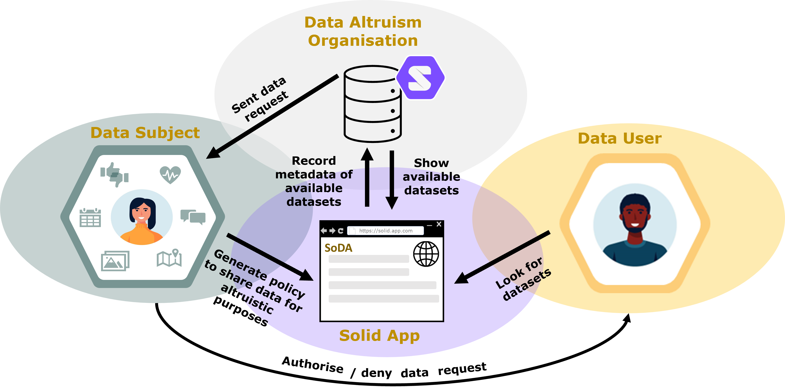

# Repository of ISWC'23 demo paper "Towards an Architecture for Data Altruism in Solid"

## Description

An architecture to implement data altruism as a service using the Solid protocol and ODRL policies to grant access to personal data for altruistic purposes in a privacy-friendly manner.

**Work developed by:**

Beatriz Esteves ([beatriz.gesteves@upm.es](mailto:beatriz.gesteves@upm.es)), Ontology Engineering Group, Universidad Politécnica de Madrid, Spain